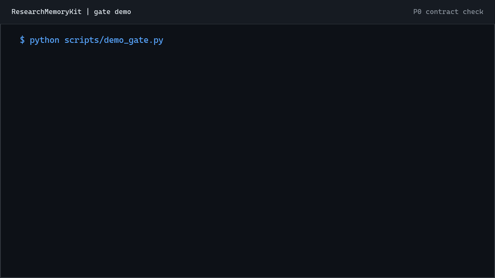

# ResearchMemoryKit

A Markdown-first project memory and gated workflow for long-running AI-assisted research and engineering.

[](LICENSE)
[](pyproject.toml)
[](https://github.com/qzSOS/ResearchMemoryKit/actions/workflows/validate.yml)
[](README.zh-CN.md)
[](https://linux.do)

ResearchMemoryKit is a lightweight, Git-native way to run long-lived
AI-assisted research and engineering projects. Its core is deliberately
simple: a small set of Markdown files records the current state, decisions,
failed routes, evidence boundaries, and completion gates.

Humans and agents read and update these files to recover context, steer the
project, preserve an audit trail, and decide when work is actually complete.
You can adopt the method without installing a service or Python package.
Templates and prompts help you adapt it to a real project; an optional
`rmk.json` contract and `rmk check` command can catch structural drift.

```text
Current State
  -> Decision / Gate
  -> Registered work
  -> Execution
  -> Evidence review
  -> Conclusion or failure
  -> Pitfall / Session update
  -> Current State replacement
```

中文说明: [README.zh-CN.md](README.zh-CN.md)

## What It Helps With

- **Context recovery**: a new human or agent can restart from a short Current State file.
- **Project steering**: decisions include rationale, alternatives, and revisit conditions, so the project can stop weak routes instead of drifting.
- **Trusted research workflow**: written completion gates require results, failures, pitfalls, and state changes to be reviewed before work is closed.
- **Reproducible engineering**: metadata, commands, outputs, and evidence boundaries stay connected.
- **Agent autonomy with guardrails**: agents can push work forward, but gates define what counts as real progress.

## Start With Markdown

No installation is required to use the pattern. Copy and adapt one of the
templates, or ask an agent to design the smallest useful memory layer for the
actual project.

The included initializer is a convenience:

```bash
git clone https://github.com/qzSOS/ResearchMemoryKit.git
cd ResearchMemoryKit
python scripts/init_memory.py research-project /tmp/my-research-project
```

Replace `research-project` with `minimal` or `delivery-project` when those
profiles fit better. Then fill the generated Current State, define the written
completion gates, and commit the Markdown files with the project.

For read-only examples, open:

- [examples/toy-research-project](examples/toy-research-project) for the smallest complete memory layer;
- [examples/fictional-paper-project](examples/fictional-paper-project) for a gated paper-style workflow.

## Optional: 30-Second Structure Check



The animation comes from an executable fictional demo. The first check catches
a broken Current State route and a missing gate heading. After those contract
errors are repaired, the same project passes.

```bash
git clone https://github.com/qzSOS/ResearchMemoryKit.git
cd ResearchMemoryKit
python scripts/demo_gate.py
```

See [docs/gate-demo.md](docs/gate-demo.md) for the transcript and the exact P0
boundary.

To add the optional checker to your own project:

```bash
python -m pip install -e . --no-deps
rmk check /tmp/my-research-project
```

The checker reports missing files, broken routes, stale state, unresolved
placeholders, and missing declared gate headings. It does not judge whether a
scientific claim is true or whether the evidence is sufficient.

## Why This Exists

AI coding agents are good at local execution, but long research projects fail in different ways:

- the current status is buried in a long chat history;
- decisions are copied into multiple files and drift;
- failed experiments disappear, then get repeated;
- "temporary" notes become permanent clutter;
- agents update familiar files but skip the new memory structure;
- agents keep executing tasks without proving that a research gate passed;
- generated outputs grow faster than the project can explain them.

ResearchMemoryKit treats these as normal research-engineering failure modes. It keeps the system small enough to maintain by hand, while giving every new session a reliable recovery path and every major step an auditable completion condition.

## Core Pattern

Every project starts with a few files:

```text
AGENTS.md or README.md       recovery router and project rules
memory/CURRENT_STATE.md      overwriteable current snapshot
memory/DECISIONS.md          append-only decisions
memory/EXPERIMENT_LOG.md     append-only conclusions, reformattable presentation
memory/FAILED_ATTEMPTS.md    append-only failed routes and preserved lessons
memory/PITFALLS.md           append-only recurring bugs and diagnostics
memory/SESSION_LOG.md        append-only significant activity
memory/WORKFLOW.md           completion gates and operating rules
registry/                    optional experiment metadata only
```

The critical rule is simple:

> A task is not complete until its gate has passed and the memory layer reflects what changed.

## Optional Structural Checks

The Markdown records and written gates are the system of record. Projects that
want CI enforcement can also add an explicit `rmk.json` contract. The P0
checker validates required files, path safety, router reachability, gate
headings, Current State dates, staleness, and unresolved placeholders.

```bash
rmk check /path/to/project
rmk check /path/to/project --strict
rmk check /path/to/project --format json
```

Normal mode fails on broken contracts. `--strict` also fails on warnings,
which makes it suitable for CI. See [docs/rmk-check.md](docs/rmk-check.md) for
the optional manifest and stable finding codes.

P0 validates contract health. It does not judge evidence quality, scientific
soundness, or claim truth. Those remain workflow and review responsibilities.

## Key Ideas

- **Current State first**: a short, overwriteable snapshot is the entry point for every session.
- **History is append-only**: decisions, failures, and conclusions preserve provenance.
- **Routers stay boring**: routers describe where to read, not what the current result is.
- **One fact, one source**: duplicate mutable truth is treated as a bug.
- **Completion gates activate behavior**: templates only work when memory updates are part of the definition of done.
- **Gates steer the project**: experiments, pivots, and deliverables have explicit pass/fail or revisit conditions.
- **Evidence boundaries matter**: do not turn preliminary results into stronger claims than the evidence supports.

## Use With an Agent

For a private or internal project, you can give a coding agent this short
instruction:

```text
Use the ResearchMemoryKit method for this project. Inspect the project goals and workflow, then create the smallest useful Markdown memory layer. Define written completion gates, authoritative files, and the session recovery order. Preserve operational facts needed to resume the work. Prefer repository-relative paths or named environment roots in shared files, and use a gitignored local file for machine-specific mappings when practical. Never store credentials in project memory. If automated structural checks would help, also create rmk.json and run rmk check. Ask before preparing any content for public release.
```

Longer prompts are available in [docs/agent-prompts.md](docs/agent-prompts.md).
The adaptive prompt covers projects that do not fit a fixed template.

## Which Template Should I Use?

| Template | Best for | Includes |
|---|---|---|
| `minimal` | small projects, reading notes, one-person prototypes | Current State, Decisions, Session Log |
| `research-project` | ML/AI research, experiments, paper work, long baselines | memory router, experiment log, failed attempts, pitfalls, workflow gate, registry |
| `delivery-project` | engineering reports, client-facing artifacts, generated figures/videos | project state, delivery index, decision log, work log, evidence-boundary rules |

## How It Compares

| Tool category | What it is good at | ResearchMemoryKit difference |
|---|---|---|
| Agent memory databases | storing and retrieving agent memories | file-based, inspectable, git-native, no service required |
| Experiment trackers | metrics, dashboards, runs, artifacts | captures rationale, failed routes, current state, and evidence boundaries |
| Project management tools | tasks, owners, deadlines | designed for research uncertainty and multi-session agent handoff |
| Notes apps | flexible human notes | adds lifecycle semantics and completion gates |

See [docs/comparison.md](docs/comparison.md) for the longer version.

## Documentation

| Need | Read |
|---|---|
| Adopt the Markdown workflow in a new or existing project | [Adoption guide](docs/adoption-guide.md) |
| Give an agent a realistic startup prompt | [Agent prompts](docs/agent-prompts.md) |
| See a real fail-and-pass checker run | [Gate demo](docs/gate-demo.md) |
| Understand `rmk.json` and finding codes | [`rmk check` reference](docs/rmk-check.md) |
| Design research, direction, and delivery gates | [Gated research workflow](docs/gated-research-workflow.md) |
| Run the contract check in GitHub Actions | [CI guide](docs/ci.md) |
| Publish a private project safely | [Publishing safely](docs/publishing-safely.md) |
| Understand the design tradeoffs | [Theory](docs/theory.md) and [comparison](docs/comparison.md) |

The root `memory/` directory is intentional. It records only the development
of ResearchMemoryKit itself and acts as a public self-hosting example of the
Markdown workflow. This repository also uses the optional contract checker on
that structure. It contains no memory copied from private research projects.

## Further Reading

- [AI Research Agents Need Gates, Not Just Memory](docs/blog/ai-research-agents-need-gates.md)
- [AI 科研 Agent 需要的不只是记忆，而是门控](docs/blog/ai-research-agents-need-gates-zh.md)

## When To Use This

Use ResearchMemoryKit when:

- a project spans weeks or months;
- multiple agents or sessions will touch it;
- failed experiments are useful evidence;
- decisions need rationale and revisit conditions;
- current status must be recoverable without reading the whole chat history;
- the project needs gates before claims, pivots, or deliverables are accepted.

Do not use it when:

- the task fits in one short session;
- a real experiment tracking platform is already required;
- the team needs permissions, dashboards, or a database-backed workflow.

## About

This project was created by [qzSOS](https://github.com/qzSOS). Public examples
are fictional; guidance for publishing a private project is kept separate in
[docs/publishing-safely.md](docs/publishing-safely.md).

## Roadmap

- registry lifecycle and experiment cross-reference checks;
- git-aware append-only deletion detection;
- claim evidence and human-review status;
- conservative router-truth-duplication checks;
- optional active indexes for very large append-only files;
- more executable fictional examples;
- PyPI distribution and a lower-friction install path;
- a small GitHub Pages documentation site;
- starter prompts for common coding agents.

## License

MIT License. See [LICENSE](LICENSE).
